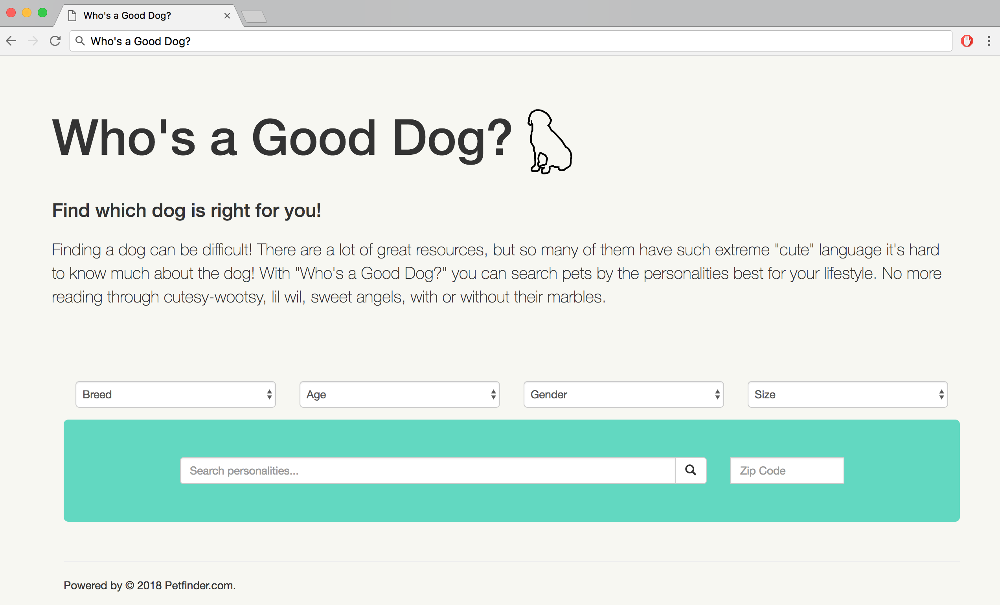
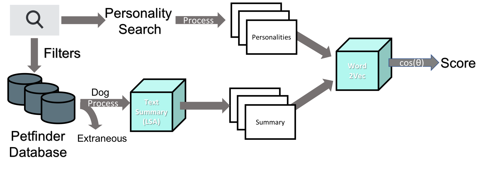

# Who's a Good Dog?

Two years ago, my partner and I went through a really lengthy and frustrating search for our dog, Lola Ray. We knew that we wanted a very particular dog for our lifestyle: her being active and constantly looking for a running partner, and me being endlessly lazy and wanting a snuggler. We knew it would be a hard match to find, but what we didn't expect was how hard it could be to understand the puppy-talk that dominates pet-descriptions on adoption websites.

I was ultimately motivated by this experience for my Insight project. So I came up with "Who's a Good Dog?": an app that provides a better way to search for adoptable dogs. Instead of hoping for the best when searching by breed, size, age, etc; you search for the personality traits that matter most to you!

# Algorithm

Dogs listings are queried from the Petfinder API in real time to ensure that you're able to find dogs actually up for adoption.

Text-descriptions are processed to ensure that the text documents are actually describing the dog. This relies on a Naïve Bayes classifier to identify the subject content and ensure it's dog-focused. Summaries are generated from the pet-descriptions using Latent Semantic Analysis to highlight the important descriptors from the text. Both summaries and search queries are embedded into word vectors using Word2Vec pre-trained on the spaCy large, english web-corpus model.

For all returned pet-description a score is assigned using the average cosine-similarity between summaries and search word-vectors.
